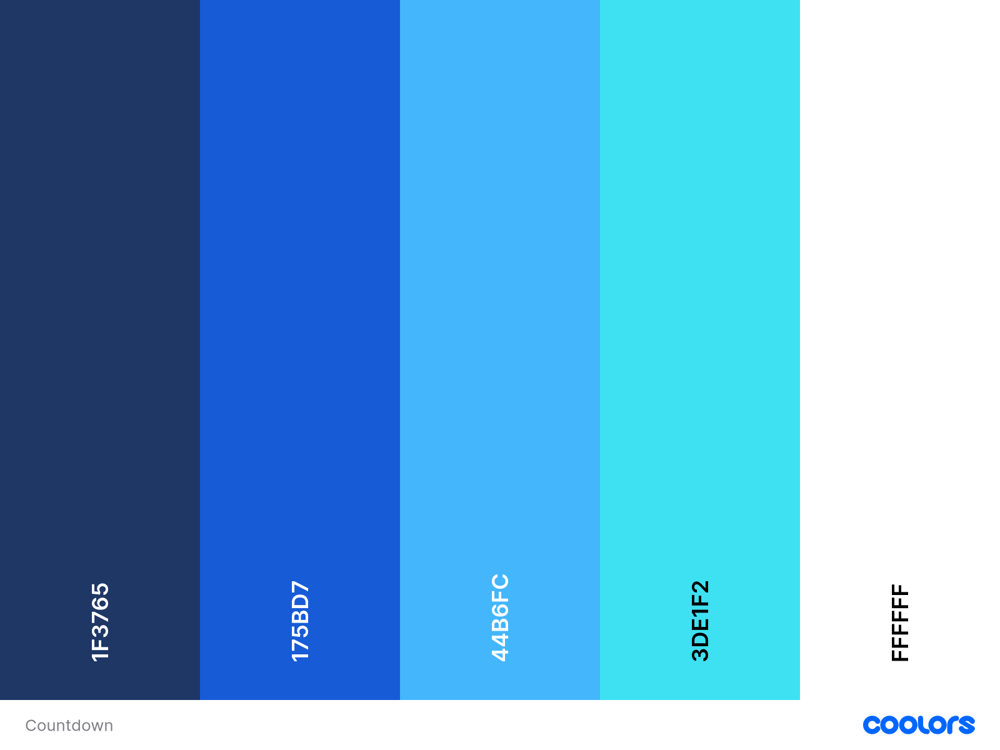
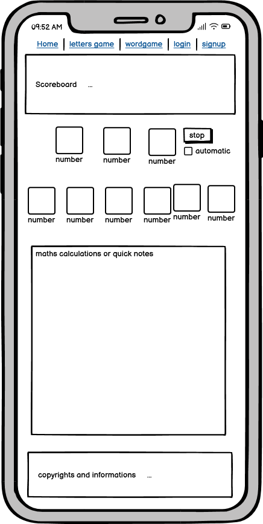

# The Final Jardown

The Final Jardown is a web-based application that brings the excitement and challenge of the Countdown game show to your fingertips. Developed using Django, this project aims to replicate the classic Countdown experience, allowing users to engage in various game modes, including the iconic letters and numbers rounds. 

Join us in this exciting journey and test your skills in The Final Jardown!

## Contents:
- [User Experience](#user-experience)
    - [User Stories](#user-stories)
    - [Design](#design)
        - [Colour Scheme](#colour-scheme)
        - [Typography](#typography)
    - [Wireframes](#wireframes)
    - [Accessibility](#accessibility)
- [Key Features](#key-features)
    - [General](#general)
    - [Game Modes](#game-modes)
        - [Letters](#letters)
        - [Numbers](#numbers)
- [Future Features](#future-features)
    - [Scoreboard](#scoreboard)
- [AI Implementation](#ai-implementation)
- [Testing](#testing)
- [Deployment](#deployment)
- [Forking and Cloning the Repository](#forking-and-cloning-the-repository)
    - [Forking the Repository](#forking-the-repository)
    - [Cloning the Repository](#cloning-the-repository)
- [Team: JAR](#team-jar)

## User Experience:

### User Stories:

| User Story | User Story Description                                                                 |
|---------------|----------------------------------------------------------------------------------------|
| 1             | As a Player, I want to register and log in so I can track my game progress and scores. |
| 2             | As a Player, I want to choose between letters and numbers rounds so I can play different game modes. |
| 3             | As a Player, I want to select letters from vowels and consonants so I can form the longest possible word. |
| 4             | As a Player, I want to generate a set of random numbers so I can achieve a target number using basic arithmetic operations. |
| 5             | As a Player, I want to solve arithmetic problems within a time limit to enhance my math skills. |

### Design:

As a team, we set out to ensure the design of this project was on theme. This meant using a lot of blues and other colors inspired by the Countdown set. We aimed to capture the essence of the game show, creating a familiar and engaging experience for users. The design choices, from the color scheme to the typography, were all carefully selected to reflect the look and feel of Countdown, making The Final Jardown both visually appealing and true to its inspiration.

#### Colour Scheme:

The colour scheme for The Final Jardown is pictured below. It was made by colour picking an image of the set of Countdown. 




#### Typography:


[Lato](https://fonts.google.com/specimen/Lato?query=%C5%81ukasz%20Dziedzic) was chosen for its clean and modern look, which closely resembles the font used in Countdown. This similarity helps to maintain the thematic consistency of the application. Additionally, Lato is a free and open-source font, making it an accessible choice for our project.


### Wireframes:

While working on this project, the wireframes were made using Balsamiq. Balsamiq is a rapid wireframing tool that reproduces the experience of sketching on a whiteboard but using a computer. This tool allowed us to quickly iterate on design ideas and create clear, concise wireframes that effectively communicated our vision for The Final Jardown.




#### Accessibility:

We have taken several steps to ensure that The Final Jardown is accessible to all users, including those with disabilities. Our accessibility features include:

- **Color Contrast:** We have ensured sufficient color contrast between text and background to make content readable for users with visual impairments.
- **Readable Text Size/Font:** We used an easy to read font, with the font size at a suitable size so people can easily read it.

We are committed to continuous improvement and welcome feedback on how we can further enhance accessibility.
## Key Features:

### General:
- **Fully Responsive Navbar with Navigational Links:**
    - The application features a fully responsive navigation bar that adapts to different screen sizes and devices. This ensures a seamless user experience whether accessed on a desktop, tablet, or mobile device.
    - The navbar includes links to all major sections of the application, such as Home, Numbers, Letters, User Profile, and more, allowing users to easily navigate through the site.

- **Footer with Copyright Information:**
    - The footer is designed to be consistent across all pages of the application, providing a cohesive look and feel.
    - It includes copyright information to protect the intellectual property of the developers and acknowledge the creation date of the application.


### Game Modes:

#### Letters:
- **Select up to 9 letters:** Players can choose up to 9 letters for each round.
- **Consonant and Vowel Selection:** Buttons are provided for selecting consonants and vowels, mimicking the game show experience.
- **Word Validation:** Integration with the DictionaryAPI.dev API to check if the formed word exists, ensuring valid entries.

#### Numbers:
- **Select Large and Small Numbers:** Players can choose a combination of large and small numbers, similar to the game show format.
- **Target Number Generation:** A random target number is generated for players to reach using the selected numbers.
- **Answer Validation:** The application checks if the player's answer is correct and awards points based on how close it is to the number.

### Future Features:

#### Scoreboard:
- **Highscores:** Display a scoreboard with the highscores of recent players.
- **User Profiles:** Utilize user profiles to display each user's recent scores.
- **Dynamic Updates:** The scoreboard updates dynamically as new scores are recorded.
- **Leaderboard:** A leaderboard feature to showcase top players and their achievements.
- **User Statistics:** Provide detailed statistics for each user, including their highest score, average score, and number of games played.
- **Social Sharing:** Allow users to share their scores on social media platforms to encourage competition and engagement.


## AI Implementation:

- **Writing Unit Tests for Django:** AI was utilized to generate comprehensive unit tests for the Django application, ensuring robust and reliable code. These tests helped in identifying and fixing bugs early in the development process, leading to a more stable application.

- **Generating Copy for the Home Page:** AI assisted in creating engaging and informative content for the home page. This included crafting compelling descriptions and calls to action that effectively communicated the purpose and features of The Final Jardown to users.

- **Troubleshooting Issues with the API:** Before switching to DictionaryAPI.dev, AI was instrumental in diagnosing and resolving issues with the initial API integration. This involved analyzing error messages, suggesting potential fixes, and optimizing the API usage to improve performance and reliability.

- **Debugging:** AI was used to identify and resolve bugs in the codebase. By analyzing error logs and suggesting fixes, AI helped streamline the debugging process, ensuring a smoother development experience.

- **Styling Forms:** Used AI to reduce the time needed for styling forms by creating templates and applying them, followed by manual adjustments as needed.

By leveraging AI, we were able to enhance the development process, improve the quality of our code, and create a more polished and user-friendly application.

## Testing:

Refer to [TESTING.md](docs/TESTING.md) for details on testing.

## Deployment:

To deploy The Final Jardown to Heroku using GitHub, follow these steps:

1. **Create a Heroku Account:**
    - If you don't already have a Heroku account, sign up at [Heroku](https://signup.heroku.com/).

2. **Create a New Heroku App:**
    - Log in to your Heroku account.
    - Click on the "New" button in the top right corner and select "Create new app".
    - Enter a unique name for your app and choose your region.
    - Click "Create app".

3. **Connect to GitHub:**
    - In the "Deploy" tab of your new app, find the "Deployment method" section.
    - Select "GitHub" as the deployment method.
    - Click the "Connect to GitHub" button.
    - Authorize Heroku to access your GitHub account if prompted.
    - Search for the repository `the-final-jardown` and click "Connect".

4. **Enable Automatic Deploys (Optional):**
    - In the "Automatic deploys" section, you can choose to enable automatic deploys from the `main` branch.
    - This will automatically deploy your app whenever you push changes to the `main` branch on GitHub.

5. **Manual Deployment:**
    - In the "Manual deploy" section, select the branch you want to deploy (e.g., `main`).
    - Click the "Deploy Branch" button to manually deploy your app.

6. **Configure Environment Variables:**
    - Go to the "Settings" tab of your Heroku app.
    - Click on "Reveal Config Vars" in the "Config Vars" section.
    - Add the necessary environment variables for your Django application (e.g., `SECRET_KEY`, `DATABASE_URL`, etc.).

7. **Run Migrations:**
    - After deployment, you need to run database migrations.
    - Go to the "More" dropdown in the top right corner of your app's dashboard and select "Run console".
    - In the console, run the following commands:
      ```bash
      python manage.py migrate
      ```

8. **Collect Static Files:**
    - In the same console, run:
      ```bash
      python manage.py collectstatic
      ```

Your application should now be deployed and running on Heroku. You can access it via the URL provided in the Heroku dashboard.

## Forking and Cloning the Repository:

### Forking the Repository:

1. **Navigate to the Repository:**
    - Go to the GitHub page of the repository: [the-final-jardown](https://github.com/aminoacid-01/the-final-jardown).

2. **Fork the Repository:**
    - Click the "Fork" button in the top right corner of the repository page.
    - This will create a copy of the repository under your GitHub account.

### Cloning the Repository:

1. **Clone the Forked Repository:**
    - Open your terminal or command prompt.
    - Navigate to the directory where you want to clone the repository.
    - Run the following command, replacing `yourusername` with your GitHub username:
      ```bash
      git clone https://github.com/yourusername/the-final-jardown.git
      ```

2. **Navigate to the Project Directory:**
    - Change into the project directory:
      ```bash
      cd the-final-jardown
      ```
3. **Set up your database:**
    - Create an env.py file with the following code:
      ```python
      import os


      os.environ.set_default(
        'DATABASE_URL', 'your-database-url'
      )
      ```
    - Make migrations to set up your database with our models.
      ```bash
      python manage.py makemigrations
      python manage.py migrate
      ```

You are now ready to make changes to the project!


## Team: JAR

- Amina: [Github](https://github.com/aminoacid-01) 
- JJ: [Github](https://github.com/newworldhost/) 
- Richard [Github](https://github.com/Richfletch92) 


