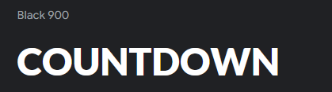

# The Final Jardown

The Final Jardown is a web-based application that brings the excitement and challenge of the Countdown game show to your fingertips. Developed using Django, this project aims to replicate the classic Countdown experience, allowing users to engage in various game modes, including the iconic letters and numbers rounds. 

Join us in this exciting journey and test your skills in The Final Jardown!

## Contents:
- [User Experience](#user-experience)
    - [User Stories](#user-stories)
    - [Design](#design)
    - [Wireframes](#wireframes)
- [Database](#database)
- [Key Features](#key-features)
    - [General](#general)
    - [Letters](#letters)
    - [Numbers](#numbers)
- [Technologies](#technologies)
- [AI](#ai)
- [Testing](#testing)
- [Credits](#credits)

## User Experience:

### User Stories:

| User Story | User Story Description                                                                 |
|---------------|----------------------------------------------------------------------------------------|
| 1             | As a Player, I want to register and log in so I can track my game progress and scores. |
| 2             | As a Player, I want to choose between letters and numbers rounds so I can play different game modes. |
| 3             | As a Player, I want to select letters from vowels and consonants so I can form the longest possible word. |
| 4             | As a Player, I want to generate a set of random numbers so I can achieve a target number using basic arithmetic operations. |
| 5             | As a Player, I want to solve arithmetic problems within a time limit to enhance my math skills. |

### Design:

As a team, we set out to ensure the design of this project was on theme. This meant using a lot of blues and other colors inspired by the Countdown set. We aimed to capture the essence of the game show, creating a familiar and engaging experience for users. The design choices, from the color scheme to the typography, were all carefully selected to reflect the look and feel of Countdown, making The Final Jardown both visually appealing and true to its inspiration.

#### Colour Scheme:

The colour scheme for The Final Jardown is pictured below. It was made by colour picking an image of the set of Countdown. 

#### Typography:

[Lato](https://fonts.google.com/specimen/Lato?query=%C5%81ukasz%20Dziedzic) was chosen for its clean and modern look, which closely resembles the font used in Countdown. This similarity helps to maintain the thematic consistency of the application. Additionally, Lato is a free and open-source font, making it an accessible choice for our project.

### Wireframes:

While working on this project, the wireframes were made using Balsamiq.

#### Accessibility:

We have taken several steps to ensure that The Final Jardown is accessible to all users, including those with disabilities. Our accessibility features include:

- **Color Contrast:** We have ensured sufficient color contrast between text and background to make content readable for users with visual impairments.
- **Readable Text Size/Font:** We used an easy to read font, with the font size at a suitable size so people can easily read it.

We are committed to continuous improvement and welcome feedback on how we can further enhance accessibility.
## Key Features:

### General:
- **Fully responsive navbar with navigational links**
- **Footer w/ copyright**

### Game Modes:

#### Letters:
- **Select up to 9 letters:** Players can choose up to 9 letters for each round.
- **Consonant and Vowel Selection:** Buttons are provided for selecting consonants and vowels, mimicking the game show experience.
- **Word Validation:** Integration with the DictionaryAPI.dev API to check if the formed word exists, ensuring valid entries.

#### Numbers:
- **Select Large and Small Numbers:** Players can choose a combination of large and small numbers, similar to the game show format.
- **Target Number Generation:** A random target number is generated for players to reach using the selected numbers.
- **Solution Validation:** The application checks if the player's solution is correct and provides feedback.

## Team: JAR

- Amina: [Github](https://github.com/aminoacid-01) |
- JJ: [Github](https://github.com/newworldhost/) |
- Richard [Github](https://github.com/Richfletch92) |

