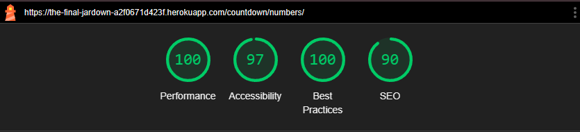

# Testing:

## Manual Testing

| Test Description                                    | Status |
|-----------------------------------------------------|--------|
| Navigational links in the Navbar work               | Pass   |
| Responsive on multiple screen sizes/ Devices        | Pass   |
| Tested for functionality on multiple browsers       | Pass   |
| Links on homepage working                           | Pass   |
| External links to GitHub opening in new page        | Pass   |

## Validators

### W3C

### CSS

**style.css:**

### JsHint

**lettergame.js:**

**numbersgame.js:**

**clock.js:**

### Lighthouse

**Home:**  

- Mobile:

- Desktop:

**Letters:**

- Mobile:

- Desktop:

**Numbers:**

- Mobile:

- Desktop:

## Unit Testing:
# Testing

## Test Cases

| Test Case ID | Test Case Description                                                                 | Expected Outcome                                                                 | Pass/Fail |
|--------------|---------------------------------------------------------------------------------------|----------------------------------------------------------------------------------|-----------|
| 1            | Test that a profile is created when a user is created                                 | A `Profile` instance is created and associated with the user, and the username is 'testuser'. |           |
| 2            | Test updating the profile                                                             | The profile's `bio`, `location`, and `birth_date` fields are updated correctly.  |           |
| 3            | Test deleting the user and profile                                                    | The profile associated with the user is deleted, and the profile count is 0.     |           |